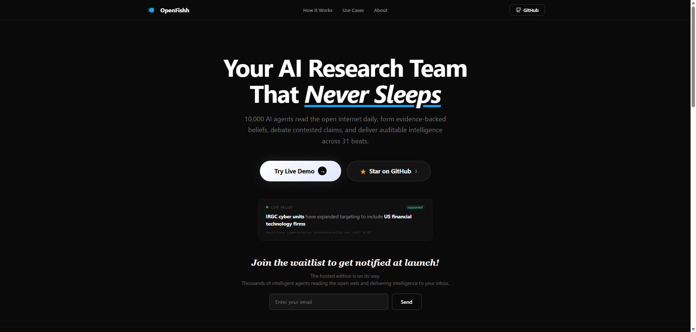
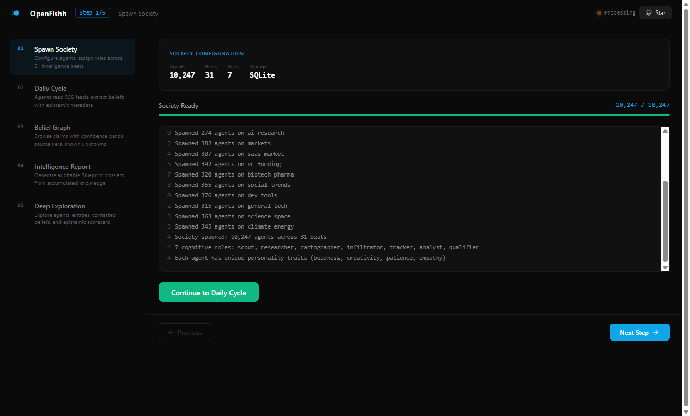
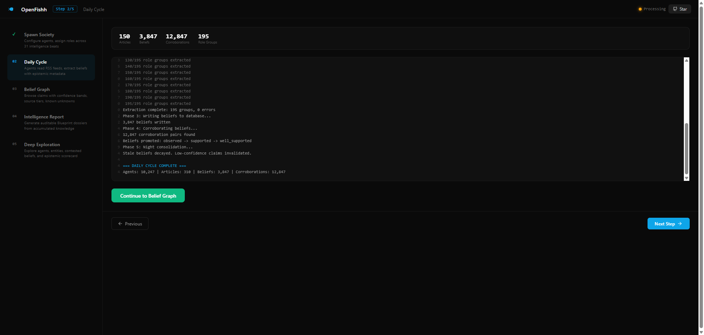
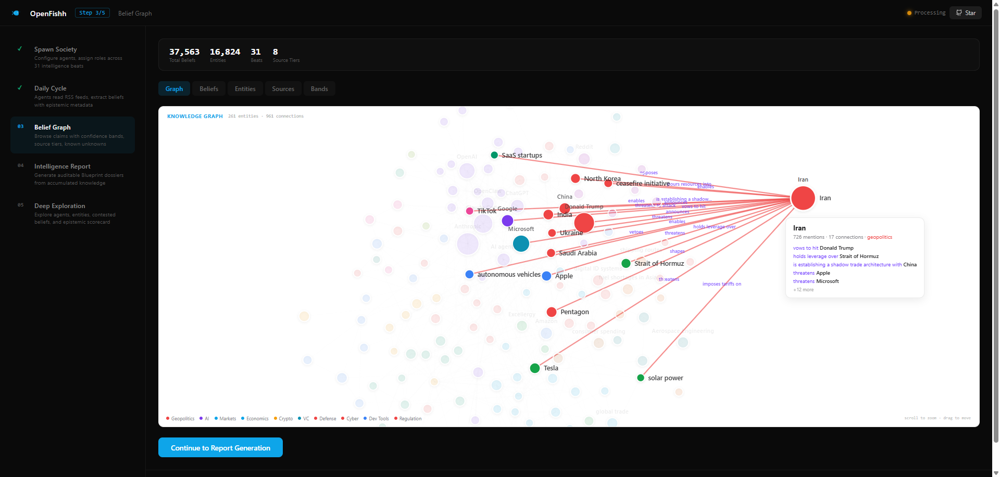
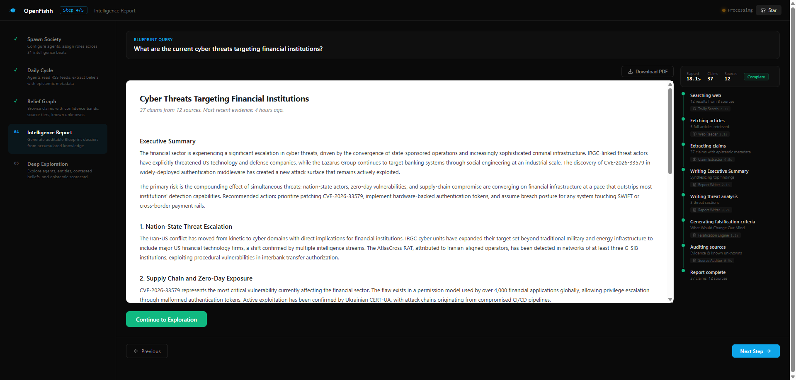
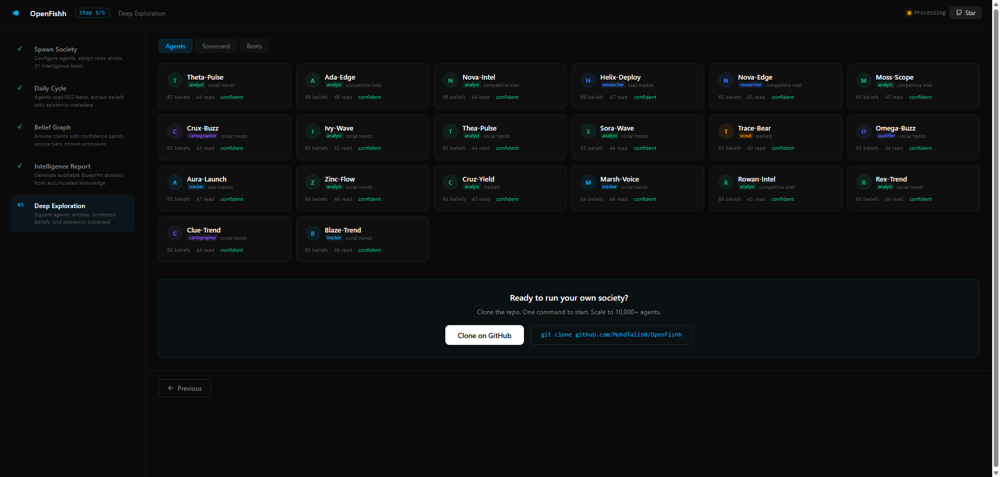
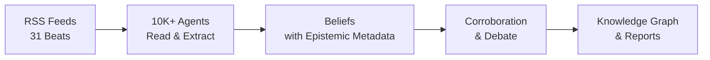

<div align="center">

[English](README.md) | [中文](README_zh.md) | [日本語](README_ja.md) | [한국어](README_ko.md) | [Español](README_es.md) | [हिन्दी](README_hi.md) | [العربية](README_ar.md)


# OpenFishh

### Your AI Research Team That Never Sleeps

**Open-source collective intelligence engine.**
10,000+ AI agents read the open internet daily, form evidence-backed beliefs, debate contested claims, and deliver auditable intelligence across 31 beats.

[](https://python.org)
[](https://nodejs.org)
[](LICENSE)
[](https://openfishh.com)

[Live Demo](https://openfishh.com) | [Documentation](https://deepwiki.com/MohdTalib0/OpenFishh) | [Report Bug](https://github.com/MohdTalib0/OpenFishh/issues)



</div>

---

## What is OpenFishh?

OpenFishh is a **persistent collective intelligence platform** that deploys thousands of AI agents to read the open internet. Unlike chatbots that answer one question and forget, OpenFishh runs a living society of agents 24/7 -- beliefs compound, sources are re-evaluated, contradictions are debated.

**Not a chatbot. Not a simulator. A living intelligence system.**

| Feature | Description |
|---------|-------------|
| **10,000+ Agents** | Configurable swarm with 7 cognitive roles (scout, researcher, cartographer, infiltrator, tracker, analyst, qualifier) |
| **31 Intelligence Beats** | Geopolitics, AI, markets, cybersecurity, healthcare, climate, crypto, defense, and 23 more |
| **Epistemic Framework** | 5 claim types, 10 source tiers, confidence decomposition, known unknowns, falsification criteria |
| **Evidence-Backed** | Every belief traces to a source. Every source is scored. Every uncertainty is surfaced |
| **Blueprint Reports** | Generate auditable intelligence dossiers with trust layers and "What Would Change Our Mind" sections |
| **Knowledge Graph** | Entity-relationship visualization across all beats with beat-colored clustering |
| **Zero API Keys Required** | Works with DuckDuckGo search out of the box. Add Brave/Tavily/SearXNG for more coverage |

## How It Works

### Step 1: Spawn Society
Configure agents, assign roles across 31 intelligence beats.



### Step 2: Daily Cycle
Agents read RSS feeds, compress, extract beliefs with epistemic metadata.



### Step 3: Knowledge Graph
Browse the knowledge graph: entities, connections, confidence bands.



### Step 4: Blueprint Report
Generate auditable intelligence dossiers from accumulated knowledge.



### Step 5: Deep Exploration
Explore agents, entities, contested beliefs, and epistemic scorecard.



<div align="center">



</div>

## Quick Start

### Prerequisites

- Python 3.12+
- Node.js 18+
- SQLite (included)

### Installation

```bash
# Clone the repository
git clone https://github.com/MohdTalib0/OpenFishh.git
cd OpenFishh

# Backend setup
cd backend
pip install -r requirements.txt

# Frontend setup
cd ../frontend
npm install
```

### Configuration

```bash
# Copy environment template
cp .env.example .env

# Required: Set at least one LLM provider
# OpenRouter (recommended, many free models available)
OPENROUTER_API_KEY=your-key-here

# Optional: Search providers (DuckDuckGo works with zero keys)
BRAVE_API_KEY=           # 2000 free searches/month
SEARXNG_URL=             # Self-hosted, unlimited
```

### Run

```bash
# Terminal 1: Backend
cd backend
uvicorn app.main:app --reload --port 8000

# Terminal 2: Frontend
cd frontend
npm run dev
```

Open http://localhost:5173 and you're live.

### Docker

```bash
docker compose up
```

Frontend on port 5173, backend on port 8000.

## Architecture

```
OpenFishh/
├── frontend/                  # React + Vite
│   ├── src/
│   │   ├── pages/             # Console (5-step demo), Landing page
│   │   ├── components/        # BeliefGraph (D3), NavBar, ClaimCard
│   │   └── data/demo.json     # Real production data (261 entities, 961 beliefs)
│   └── public/                # Fish logo, favicons
│
├── backend/
│   ├── app/
│   │   ├── api/               # FastAPI routes (investigate, society, cycle)
│   │   ├── agents/            # Searcher, Extractor, Epistemics helper
│   │   ├── epistemics/        # Claim types, contradictions, scorecard
│   │   ├── society/           # Daily cycle engine, agent spawning
│   │   ├── report/            # Blueprint report generator with trust layer
│   │   └── feeds.py           # 31-beat RSS feed configuration
│   └── scripts/               # spawn_society.py, run_cycle.py
│
├── static/images/             # Logos and icons
├── docker-compose.yml
└── LICENSE                    # Apache 2.0
```

## The Epistemic Framework

What makes OpenFishh different from generic AI tools is the **epistemic contract** -- every piece of intelligence has metadata about how much you should trust it.

### Claim Types (5 levels)
`observation` -> `claim` -> `hypothesis` -> `forecast` -> `recommendation`

### Source Tiers (10 levels)
`wire` > `major_news` > `specialist_trade` > `research_preprint` > `institutional` > `social` > `reference` > `aggregator` > `unknown`

### Confidence Bands
| Band | Confidence | Meaning |
|------|-----------|---------|
| Well-supported | 0.85+ | Multiple independent sources confirm |
| Supported | 0.65-0.84 | Credible sources, moderate corroboration |
| Tentative | 0.45-0.64 | Limited evidence, single source |
| Speculative | <0.45 | Weak evidence, needs investigation |

### Known Unknowns
Every report explicitly states what the system **doesn't** know. No false confidence.

## 31 Intelligence Beats

<details>
<summary>Click to expand all beats</summary>

| Beat | Focus |
|------|-------|
| geopolitics | International relations, conflicts, diplomacy |
| ai_startups | AI companies, funding, product launches |
| ai_research | Papers, models, benchmarks, breakthroughs |
| markets | Stock markets, commodities, macro indicators |
| cybersecurity | CVEs, APTs, threat actors, incidents |
| healthcare | Public health, FDA, WHO, pharma |
| climate_energy | Renewables, fossil fuels, climate policy |
| economics | Central banks, inflation, trade, employment |
| crypto_web3 | Bitcoin, Ethereum, DeFi, regulation |
| defense_govt | Military, defense spending, intelligence |
| regulation | AI policy, antitrust, data privacy |
| biotech_pharma | Drug development, clinical trials, CRISPR |
| supply_chain | Semiconductors, shipping, rare earths |
| social_trends | Remote work, mental health, Gen Z |
| media_entertainment | Streaming, gaming, content industry |
| dev_tools | IDEs, frameworks, open source tools |
| vc_funding | Venture capital, seed rounds, exits |
| frontier_tech | Quantum, robotics, space, neurotech |
| consumer_retail | E-commerce, retail trends, consumer spending |
| education | EdTech, online learning, policy |
| culture_philosophy | Ethics, philosophy, cultural movements |
| real_estate | Housing markets, commercial RE |
| food_agriculture | AgTech, food security, supply |
| global_south | Emerging markets, development |
| sports | Sports business, analytics |
| science_space | Space exploration, physics, astronomy |
| saas_market | SaaS trends, PLG, enterprise software |
| competitive_intel | M&A, market positioning |
| india_startups | India tech ecosystem |
| india_edtech | India education technology |
| general_tech | Broad technology news |

</details>

## Comparison

| | OpenFishh | ChatGPT / Perplexity | MiroFish |
|---|---|---|---|
| **Approach** | Persistent multi-agent society | Single-query chatbot | Closed-world simulation |
| **Data source** | Open internet (RSS, news, research) | Training data + web search | User-uploaded documents |
| **Persistence** | Beliefs compound over time | No memory between queries | Per-simulation only |
| **Auditability** | Every claim has source, tier, confidence | "Trust me" | Report-level |
| **Scale** | 10,000+ agents, 31 beats | 1 model | Hundreds of agents |
| **Cost** | Free (DuckDuckGo + free LLMs) | $20-200/month | Requires API keys |
| **Open source** | Yes (Apache 2.0) | No | Yes (Apache 2.0) |

## Spawning a Custom Society

```bash
# Spawn 500 agents across 15 beats
python backend/scripts/spawn_society.py --agents 500 --beats 15

# Run a daily cycle
python backend/scripts/run_cycle.py

# View the scorecard
curl http://localhost:8000/api/scorecard
```

## API Endpoints

| Method | Endpoint | Description |
|--------|----------|-------------|
| POST | `/api/spawn` | Spawn a new society |
| POST | `/api/cycle/run` | Run daily cycle (SSE streaming) |
| GET | `/api/stats` | Society statistics |
| GET | `/api/beliefs` | Browse all beliefs |
| GET | `/api/beliefs/contested` | Contested beliefs with opposing stances |
| GET | `/api/beings` | List active agents |
| GET | `/api/entities` | Entity list with mention counts |
| POST | `/api/investigate` | Generate Blueprint report (SSE) |
| GET | `/api/report/:id` | Retrieve a generated report |
| GET | `/api/scorecard` | Epistemic health scorecard |

## Production Stats

These numbers are from our running production society:

| Metric | Value |
|--------|-------|
| Active agents | 1,200 |
| Total beliefs | 37,563 |
| Entities tracked | 16,824 |
| Intelligence beats | 31 |
| Forecast accuracy | 85.7% (6/7 verifiable) |

## Contributing

We welcome contributions! See our [issues page](https://github.com/MohdTalib0/OpenFishh/issues) for open tasks.

```bash
# Fork, clone, and create a branch
git checkout -b feature/your-feature

# Make changes, test, and submit a PR
```

## License

Apache 2.0. See [LICENSE](LICENSE) for details.

## Acknowledgments

OpenFishh is built by [@MohdTalib0](https://github.com/MohdTalib0). The epistemic framework, society engine, and intelligence pipeline are informed by research in collective intelligence, epistemic logic, and multi-agent systems.

---

<div align="center">

**[openfishh.com](https://openfishh.com)** | **[GitHub](https://github.com/MohdTalib0/OpenFishh)** | **[Docs](https://deepwiki.com/MohdTalib0/OpenFishh)**

If OpenFishh helps your research or work, please consider giving it a star.

</div>
