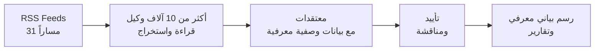

<div align="center" dir="rtl">

[English](README.md) | [中文](README_zh.md) | [日本語](README_ja.md) | [한국어](README_ko.md) | [Español](README_es.md) | [हिन्दी](README_hi.md) | **العربية**


# OpenFishh

### فريق أبحاث الذكاء الاصطناعي الذي لا ينام أبداً

**محرك ذكاء جماعي مفتوح المصدر.**
أكثر من 10,000 وكيل ذكاء اصطناعي يقرأون الإنترنت المفتوح يومياً، ويُشكّلون معتقدات مدعومة بالأدلة، ويناقشون الادعاءات المتنازع عليها، ويُقدّمون استخبارات قابلة للتدقيق عبر 31 مساراً استخباراتياً.

[](https://python.org)
[](https://nodejs.org)
[](LICENSE)
[](https://openfishh.com)

[عرض حي](https://openfishh.com) | [التوثيق](https://deepwiki.com/MohdTalib0/OpenFishh) | [الإبلاغ عن خطأ](https://github.com/MohdTalib0/OpenFishh/issues)

</div>

---

## ما هو OpenFishh؟

OpenFishh هو **منصة ذكاء جماعي مستمرة** تنشر الآلاف من وكلاء الذكاء الاصطناعي لقراءة الإنترنت المفتوح. على عكس روبوتات الدردشة التي تجيب على سؤال واحد ثم تنسى، يُشغّل OpenFishh مجتمعاً حياً من الوكلاء على مدار الساعة -- تتراكم المعتقدات، ويُعاد تقييم المصادر، وتُناقَش التناقضات.

**ليس روبوت دردشة. ليس محاكاة. إنه نظام ذكاء حي.**

| الميزة | الوصف |
|---------|-------------|
| **أكثر من 10,000 وكيل** | سرب قابل للتخصيص مع 7 أدوار معرفية (كشّاف، باحث، راسم خرائط، مُتسلل، مُتتبع، مُحلل، مُؤهِّل) |
| **31 مساراً استخباراتياً** | الجيوسياسة، الذكاء الاصطناعي، الأسواق، الأمن السيبراني، الرعاية الصحية، المناخ، العملات المشفرة، الدفاع، و23 مساراً آخر |
| **إطار معرفي** | 5 أنواع من الادعاءات، 10 مستويات للمصادر، تفكيك الثقة، مجاهيل معروفة، معايير التكذيب |
| **مدعوم بالأدلة** | كل معتقد يُتتبع إلى مصدر. كل مصدر يُقيَّم. كل حالة عدم يقين تُظهَر |
| **تقارير المخطط** | إنشاء ملفات استخباراتية قابلة للتدقيق مع طبقات ثقة وأقسام "ما الذي قد يُغيّر رأينا" |
| **رسم بياني معرفي** | تصوّر العلاقات بين الكيانات عبر جميع المسارات مع تجميع ملوّن حسب المسار |
| **لا يتطلب مفاتيح API** | يعمل مع بحث DuckDuckGo مباشرةً. أضف Brave/Tavily/SearXNG لتغطية أوسع |

## كيف يعمل

```
الخطوة 1: إنشاء المجتمع    - تخصيص الوكلاء، توزيع الأدوار عبر 31 مساراً استخباراتياً
الخطوة 2: الدورة اليومية    - الوكلاء يقرأون خلاصات RSS، يضغطون، يستخرجون المعتقدات مع بيانات وصفية معرفية
الخطوة 3: الرسم المعرفي    - تصفح الرسم البياني المعرفي: الكيانات، الروابط، نطاقات الثقة
الخطوة 4: تقرير المخطط     - إنشاء ملفات استخباراتية قابلة للتدقيق من المعرفة المتراكمة
الخطوة 5: الاستكشاف العميق - استكشاف الوكلاء، الكيانات، المعتقدات المتنازع عليها، وبطاقة الأداء المعرفية
```

<div align="center">



</div>

## البداية السريعة

### المتطلبات الأساسية

- Python 3.12+
- Node.js 18+
- SQLite (مُضمّن)

### التثبيت

```bash
# استنساخ المستودع
git clone https://github.com/MohdTalib0/OpenFishh.git
cd OpenFishh

# إعداد الخلفية
cd backend
pip install -r requirements.txt

# إعداد الواجهة
cd ../frontend
npm install
```

### الإعدادات

```bash
# نسخ قالب البيئة
cp .env.example .env

# مطلوب: تعيين مزود LLM واحد على الأقل
# OpenRouter (مُوصى به، العديد من النماذج المجانية متاحة)
OPENROUTER_API_KEY=your-key-here

# اختياري: مزودو البحث (DuckDuckGo يعمل بدون أي مفاتيح)
BRAVE_API_KEY=           # 2000 بحث مجاني/شهرياً
SEARXNG_URL=             # مستضاف ذاتياً، بلا حدود
```

### التشغيل

```bash
# الطرفية 1: الخلفية
cd backend
uvicorn app.main:app --reload --port 8000

# الطرفية 2: الواجهة
cd frontend
npm run dev
```

افتح http://localhost:5173 وأنت جاهز.

### Docker

```bash
docker compose up
```

الواجهة على المنفذ 5173، والخلفية على المنفذ 8000.

## البنية المعمارية

```
OpenFishh/
├── frontend/                  # React + Vite
│   ├── src/
│   │   ├── pages/             # وحدة التحكم (عرض من 5 خطوات)، صفحة الهبوط
│   │   ├── components/        # BeliefGraph (D3)، NavBar، ClaimCard
│   │   └── data/demo.json     # بيانات إنتاج حقيقية (261 كياناً، 961 معتقداً)
│   └── public/                # شعار السمكة، أيقونات المفضلة
│
├── backend/
│   ├── app/
│   │   ├── api/               # مسارات FastAPI (تحقيق، مجتمع، دورة)
│   │   ├── agents/            # الباحث، المستخرج، مساعد المعرفة
│   │   ├── epistemics/        # أنواع الادعاءات، التناقضات، بطاقة الأداء
│   │   ├── society/           # محرك الدورة اليومية، إنشاء الوكلاء
│   │   ├── report/            # مولّد تقارير المخطط مع طبقة الثقة
│   │   └── feeds.py           # إعدادات خلاصات RSS لـ 31 مساراً
│   └── scripts/               # spawn_society.py، run_cycle.py
│
├── static/images/             # الشعارات والأيقونات
├── docker-compose.yml
└── LICENSE                    # Apache 2.0
```

## الإطار المعرفي

ما يُميّز OpenFishh عن أدوات الذكاء الاصطناعي العامة هو **العقد المعرفي** -- كل معلومة استخباراتية تحمل بيانات وصفية حول مقدار الثقة التي يجب أن تمنحها لها.

### أنواع الادعاءات (5 مستويات)
`observation` -> `claim` -> `hypothesis` -> `forecast` -> `recommendation`

### مستويات المصادر (10 مستويات)
`wire` > `major_news` > `specialist_trade` > `research_preprint` > `institutional` > `social` > `reference` > `aggregator` > `unknown`

### نطاقات الثقة
| النطاق | الثقة | المعنى |
|------|-----------|---------|
| مدعوم جيداً | 0.85+ | مصادر مستقلة متعددة تؤكد |
| مدعوم | 0.65-0.84 | مصادر موثوقة، تأييد معتدل |
| مبدئي | 0.45-0.64 | أدلة محدودة، مصدر واحد |
| تخميني | <0.45 | أدلة ضعيفة، يحتاج تحقيقاً |

### المجاهيل المعروفة
كل تقرير يُصرّح بوضوح بما **لا** يعرفه النظام. لا ثقة زائفة.

## 31 مساراً استخباراتياً

<details>
<summary>اضغط لعرض جميع المسارات</summary>

| المسار | التركيز |
|------|-------|
| geopolitics | العلاقات الدولية، النزاعات، الدبلوماسية |
| ai_startups | شركات الذكاء الاصطناعي، التمويل، إطلاق المنتجات |
| ai_research | الأوراق البحثية، النماذج، المعايير، الاختراقات |
| markets | أسواق الأسهم، السلع، المؤشرات الكلية |
| cybersecurity | الثغرات الأمنية، التهديدات المتقدمة، الحوادث |
| healthcare | الصحة العامة، FDA، WHO، صناعة الأدوية |
| climate_energy | الطاقة المتجددة، الوقود الأحفوري، سياسات المناخ |
| economics | البنوك المركزية، التضخم، التجارة، التوظيف |
| crypto_web3 | Bitcoin، Ethereum، DeFi، التنظيم |
| defense_govt | العسكرية، الإنفاق الدفاعي، الاستخبارات |
| regulation | سياسات الذكاء الاصطناعي، مكافحة الاحتكار، خصوصية البيانات |
| biotech_pharma | تطوير الأدوية، التجارب السريرية، CRISPR |
| supply_chain | أشباه الموصلات، الشحن، المعادن النادرة |
| social_trends | العمل عن بُعد، الصحة النفسية، الجيل Z |
| media_entertainment | البث المباشر، الألعاب، صناعة المحتوى |
| dev_tools | بيئات التطوير، الأُطر البرمجية، أدوات المصدر المفتوح |
| vc_funding | رأس المال المغامر، جولات التمويل الأولية، التخارجات |
| frontier_tech | الحوسبة الكمومية، الروبوتات، الفضاء، التقنيات العصبية |
| consumer_retail | التجارة الإلكترونية، اتجاهات التجزئة، الإنفاق الاستهلاكي |
| education | تكنولوجيا التعليم، التعلم عبر الإنترنت، السياسات |
| culture_philosophy | الأخلاق، الفلسفة، الحركات الثقافية |
| real_estate | أسواق الإسكان، العقارات التجارية |
| food_agriculture | التكنولوجيا الزراعية، الأمن الغذائي، سلسلة الإمداد |
| global_south | الأسواق الناشئة، التنمية |
| sports | أعمال الرياضة، التحليلات |
| science_space | استكشاف الفضاء، الفيزياء، علم الفلك |
| saas_market | اتجاهات SaaS، النمو بقيادة المنتج، برمجيات المؤسسات |
| competitive_intel | الاندماجات والاستحواذات، التموضع السوقي |
| india_startups | منظومة التقنية في الهند |
| india_edtech | تكنولوجيا التعليم في الهند |
| general_tech | أخبار التقنية العامة |

</details>

## المقارنة

| | OpenFishh | ChatGPT / Perplexity | MiroFish |
|---|---|---|---|
| **النهج** | مجتمع وكلاء متعدد ومستمر | روبوت دردشة لاستعلام واحد | محاكاة عالم مغلق |
| **مصدر البيانات** | الإنترنت المفتوح (RSS، أخبار، أبحاث) | بيانات التدريب + بحث الويب | مستندات يرفعها المستخدم |
| **الاستمرارية** | المعتقدات تتراكم مع الوقت | لا ذاكرة بين الاستعلامات | لكل محاكاة فقط |
| **قابلية التدقيق** | كل ادعاء له مصدر، مستوى، ثقة | "ثق بي" | على مستوى التقرير |
| **الحجم** | أكثر من 10,000 وكيل، 31 مساراً | نموذج واحد | مئات الوكلاء |
| **التكلفة** | مجاني (DuckDuckGo + نماذج LLM مجانية) | 20-200 دولار/شهرياً | يتطلب مفاتيح API |
| **مفتوح المصدر** | نعم (Apache 2.0) | لا | نعم (Apache 2.0) |

## إنشاء مجتمع مخصص

```bash
# إنشاء 500 وكيل عبر 15 مساراً
python backend/scripts/spawn_society.py --agents 500 --beats 15

# تشغيل دورة يومية
python backend/scripts/run_cycle.py

# عرض بطاقة الأداء
curl http://localhost:8000/api/scorecard
```

## نقاط نهاية API

| الطريقة | نقطة النهاية | الوصف |
|--------|----------|-------------|
| POST | `/api/spawn` | إنشاء مجتمع جديد |
| POST | `/api/cycle/run` | تشغيل الدورة اليومية (بث SSE) |
| GET | `/api/stats` | إحصائيات المجتمع |
| GET | `/api/beliefs` | تصفح جميع المعتقدات |
| GET | `/api/beliefs/contested` | المعتقدات المتنازع عليها مع المواقف المتعارضة |
| GET | `/api/beings` | قائمة الوكلاء النشطين |
| GET | `/api/entities` | قائمة الكيانات مع عدد الإشارات |
| POST | `/api/investigate` | إنشاء تقرير المخطط (بث SSE) |
| GET | `/api/report/:id` | استرجاع تقرير مُنشأ |
| GET | `/api/scorecard` | بطاقة الأداء المعرفية |

## إحصائيات الإنتاج

هذه الأرقام من مجتمعنا الإنتاجي العامل:

| المقياس | القيمة |
|--------|-------|
| الوكلاء النشطون | 1,200 |
| إجمالي المعتقدات | 37,563 |
| الكيانات المتتبعة | 16,824 |
| المسارات الاستخباراتية | 31 |
| دقة التنبؤات | 85.7% (6/7 قابلة للتحقق) |

## المساهمة

نرحب بالمساهمات! انظر [صفحة المشكلات](https://github.com/MohdTalib0/OpenFishh/issues) للمهام المفتوحة.

```bash
# انسخ المستودع، استنسخه، وأنشئ فرعاً
git checkout -b feature/your-feature

# أجرِ التغييرات، اختبر، وأرسل طلب دمج
```

## الرخصة

Apache 2.0. انظر [LICENSE](LICENSE) للتفاصيل.

## شكر وتقدير

OpenFishh بُني بواسطة [@MohdTalib0](https://github.com/MohdTalib0). الإطار المعرفي، ومحرك المجتمع، وخط أنابيب الاستخبارات مستوحاة من أبحاث في الذكاء الجماعي، والمنطق المعرفي، وأنظمة الوكلاء المتعددة.

---

<div align="center">

**[openfishh.com](https://openfishh.com)** | **[GitHub](https://github.com/MohdTalib0/OpenFishh)** | **[التوثيق](https://deepwiki.com/MohdTalib0/OpenFishh)**

إذا ساعدك OpenFishh في بحثك أو عملك، يرجى التفضل بمنحه نجمة.

</div>
