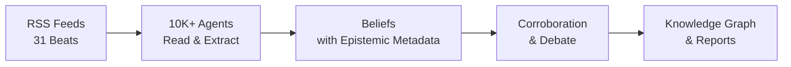

<div align="center">

[English](README.md) | [中文](README_zh.md) | [日本語](README_ja.md) | [한국어](README_ko.md) | **Español** | [हिन्दी](README_hi.md) | [العربية](README_ar.md)


# OpenFishh

### Tu Equipo de Investigación con IA Que Nunca Duerme

**Motor de inteligencia colectiva de código abierto.**
Más de 10,000 agentes de IA leen internet abierto diariamente, forman creencias respaldadas por evidencia, debaten afirmaciones controvertidas y entregan inteligencia auditable a través de 31 áreas temáticas.

[](https://python.org)
[](https://nodejs.org)
[](LICENSE)
[](https://openfishh.com)

[Demo en Vivo](https://openfishh.com) | [Documentación](https://deepwiki.com/MohdTalib0/OpenFishh) | [Reportar Error](https://github.com/MohdTalib0/OpenFishh/issues)

</div>

---

## ¿Qué es OpenFishh?

OpenFishh es una **plataforma de inteligencia colectiva persistente** que despliega miles de agentes de IA para leer internet abierto. A diferencia de los chatbots que responden una pregunta y olvidan, OpenFishh ejecuta una sociedad viva de agentes 24/7 -- las creencias se acumulan, las fuentes se reevalúan y las contradicciones se debaten.

**No es un chatbot. No es un simulador. Es un sistema de inteligencia vivo.**

| Característica | Descripción |
|----------------|-------------|
| **Más de 10,000 Agentes** | Enjambre configurable con 7 roles cognitivos (explorador, investigador, cartógrafo, infiltrador, rastreador, analista, calificador) |
| **31 Áreas de Inteligencia** | Geopolítica, IA, mercados, ciberseguridad, salud, clima, criptomonedas, defensa y 23 más |
| **Marco Epistémico** | 5 tipos de afirmaciones, 10 niveles de fuentes, descomposición de confianza, incógnitas conocidas, criterios de falsificación |
| **Respaldado por Evidencia** | Cada creencia se remonta a una fuente. Cada fuente tiene una puntuación. Cada incertidumbre se hace visible |
| **Informes Blueprint** | Genera dossieres de inteligencia auditables con capas de confianza y secciones de "Qué Cambiaría Nuestra Opinión" |
| **Grafo de Conocimiento** | Visualización de relaciones entre entidades a través de todas las áreas temáticas con agrupación por colores |
| **Cero Claves API Requeridas** | Funciona con búsqueda DuckDuckGo desde el primer momento. Agrega Brave/Tavily/SearXNG para mayor cobertura |

## Cómo Funciona

```
Paso 1: Crear Sociedad      - Configurar agentes, asignar roles en 31 áreas de inteligencia
Paso 2: Ciclo Diario         - Los agentes leen feeds RSS, comprimen, extraen creencias con metadatos epistémicos
Paso 3: Grafo de Creencias   - Navega el grafo de conocimiento: entidades, conexiones, bandas de confianza
Paso 4: Informe Blueprint    - Genera dossieres de inteligencia auditables a partir del conocimiento acumulado
Paso 5: Exploración Profunda - Explora agentes, entidades, creencias controvertidas y cuadro de mando epistémico
```

<div align="center">



</div>

## Inicio Rápido

### Requisitos Previos

- Python 3.12+
- Node.js 18+
- SQLite (incluido)

### Instalación

```bash
# Clonar el repositorio
git clone https://github.com/MohdTalib0/OpenFishh.git
cd OpenFishh

# Configuración del backend
cd backend
pip install -r requirements.txt

# Configuración del frontend
cd ../frontend
npm install
```

### Configuración

```bash
# Copiar la plantilla de entorno
cp .env.example .env

# Requerido: Configura al menos un proveedor de LLM
# OpenRouter (recomendado, muchos modelos gratuitos disponibles)
OPENROUTER_API_KEY=your-key-here

# Opcional: Proveedores de búsqueda (DuckDuckGo funciona sin claves)
BRAVE_API_KEY=           # 2000 búsquedas gratuitas/mes
SEARXNG_URL=             # Autoalojado, ilimitado
```

### Ejecutar

```bash
# Terminal 1: Backend
cd backend
uvicorn app.main:app --reload --port 8000

# Terminal 2: Frontend
cd frontend
npm run dev
```

Abre http://localhost:5173 y estarás en línea.

### Docker

```bash
docker compose up
```

Frontend en el puerto 5173, backend en el puerto 8000.

## Arquitectura

```
OpenFishh/
├── frontend/                  # React + Vite
│   ├── src/
│   │   ├── pages/             # Consola (demo de 5 pasos), Página de inicio
│   │   ├── components/        # BeliefGraph (D3), NavBar, ClaimCard
│   │   └── data/demo.json     # Datos reales de producción (261 entidades, 961 creencias)
│   └── public/                # Logo de pez, favicons
│
├── backend/
│   ├── app/
│   │   ├── api/               # Rutas FastAPI (investigate, society, cycle)
│   │   ├── agents/            # Searcher, Extractor, ayudante de Epistemics
│   │   ├── epistemics/        # Tipos de afirmaciones, contradicciones, cuadro de mando
│   │   ├── society/           # Motor de ciclo diario, generación de agentes
│   │   ├── report/            # Generador de informes Blueprint con capa de confianza
│   │   └── feeds.py           # Configuración de feeds RSS de 31 áreas temáticas
│   └── scripts/               # spawn_society.py, run_cycle.py
│
├── static/images/             # Logos e iconos
├── docker-compose.yml
└── LICENSE                    # Apache 2.0
```

## El Marco Epistémico

Lo que distingue a OpenFishh de las herramientas genéricas de IA es el **contrato epistémico** -- cada pieza de inteligencia tiene metadatos sobre cuánto deberías confiar en ella.

### Tipos de Afirmación (5 niveles)
`observation` -> `claim` -> `hypothesis` -> `forecast` -> `recommendation`

### Niveles de Fuente (10 niveles)
`wire` > `major_news` > `specialist_trade` > `research_preprint` > `institutional` > `social` > `reference` > `aggregator` > `unknown`

### Bandas de Confianza
| Banda | Confianza | Significado |
|-------|-----------|-------------|
| Bien respaldada | 0.85+ | Múltiples fuentes independientes confirman |
| Respaldada | 0.65-0.84 | Fuentes creíbles, corroboración moderada |
| Tentativa | 0.45-0.64 | Evidencia limitada, fuente única |
| Especulativa | <0.45 | Evidencia débil, necesita investigación |

### Incógnitas Conocidas
Cada informe declara explícitamente lo que el sistema **no** sabe. Sin falsa confianza.

## 31 Áreas de Inteligencia

<details>
<summary>Haz clic para expandir todas las áreas</summary>

| Área | Enfoque |
|------|---------|
| geopolitics | Relaciones internacionales, conflictos, diplomacia |
| ai_startups | Empresas de IA, financiación, lanzamientos de productos |
| ai_research | Artículos, modelos, benchmarks, avances |
| markets | Mercados bursátiles, materias primas, indicadores macroeconómicos |
| cybersecurity | CVEs, APTs, actores de amenazas, incidentes |
| healthcare | Salud pública, FDA, OMS, farmacéutica |
| climate_energy | Renovables, combustibles fósiles, política climática |
| economics | Bancos centrales, inflación, comercio, empleo |
| crypto_web3 | Bitcoin, Ethereum, DeFi, regulación |
| defense_govt | Militar, gasto en defensa, inteligencia |
| regulation | Política de IA, antimonopolio, privacidad de datos |
| biotech_pharma | Desarrollo de fármacos, ensayos clínicos, CRISPR |
| supply_chain | Semiconductores, transporte marítimo, tierras raras |
| social_trends | Trabajo remoto, salud mental, Generación Z |
| media_entertainment | Streaming, videojuegos, industria de contenidos |
| dev_tools | IDEs, frameworks, herramientas de código abierto |
| vc_funding | Capital de riesgo, rondas semilla, salidas |
| frontier_tech | Cuántica, robótica, espacio, neurotecnología |
| consumer_retail | Comercio electrónico, tendencias minoristas, gasto del consumidor |
| education | EdTech, aprendizaje en línea, política educativa |
| culture_philosophy | Ética, filosofía, movimientos culturales |
| real_estate | Mercados inmobiliarios, bienes raíces comerciales |
| food_agriculture | AgTech, seguridad alimentaria, abastecimiento |
| global_south | Mercados emergentes, desarrollo |
| sports | Negocios deportivos, analítica |
| science_space | Exploración espacial, física, astronomía |
| saas_market | Tendencias SaaS, PLG, software empresarial |
| competitive_intel | Fusiones y adquisiciones, posicionamiento de mercado |
| india_startups | Ecosistema tecnológico de India |
| india_edtech | Tecnología educativa de India |
| general_tech | Noticias generales de tecnología |

</details>

## Comparación

| | OpenFishh | ChatGPT / Perplexity | MiroFish |
|---|---|---|---|
| **Enfoque** | Sociedad multi-agente persistente | Chatbot de consulta única | Simulación de mundo cerrado |
| **Fuente de datos** | Internet abierto (RSS, noticias, investigación) | Datos de entrenamiento + búsqueda web | Documentos subidos por el usuario |
| **Persistencia** | Las creencias se acumulan con el tiempo | Sin memoria entre consultas | Solo por simulación |
| **Auditabilidad** | Cada afirmación tiene fuente, nivel y confianza | "Confía en mí" | A nivel de informe |
| **Escala** | Más de 10,000 agentes, 31 áreas | 1 modelo | Cientos de agentes |
| **Costo** | Gratuito (DuckDuckGo + LLMs gratuitos) | $20-200/mes | Requiere claves API |
| **Código abierto** | Sí (Apache 2.0) | No | Sí (Apache 2.0) |

## Creando una Sociedad Personalizada

```bash
# Crear 500 agentes en 15 áreas temáticas
python backend/scripts/spawn_society.py --agents 500 --beats 15

# Ejecutar un ciclo diario
python backend/scripts/run_cycle.py

# Ver el cuadro de mando
curl http://localhost:8000/api/scorecard
```

## Endpoints de la API

| Método | Endpoint | Descripción |
|--------|----------|-------------|
| POST | `/api/spawn` | Crear una nueva sociedad |
| POST | `/api/cycle/run` | Ejecutar ciclo diario (streaming SSE) |
| GET | `/api/stats` | Estadísticas de la sociedad |
| GET | `/api/beliefs` | Explorar todas las creencias |
| GET | `/api/beliefs/contested` | Creencias controvertidas con posturas opuestas |
| GET | `/api/beings` | Listar agentes activos |
| GET | `/api/entities` | Lista de entidades con conteos de menciones |
| POST | `/api/investigate` | Generar informe Blueprint (SSE) |
| GET | `/api/report/:id` | Obtener un informe generado |
| GET | `/api/scorecard` | Cuadro de mando de salud epistémica |

## Estadísticas de Producción

Estos números provienen de nuestra sociedad de producción en ejecución:

| Métrica | Valor |
|---------|-------|
| Agentes activos | 1,200 |
| Total de creencias | 37,563 |
| Entidades rastreadas | 16,824 |
| Áreas de inteligencia | 31 |
| Precisión de pronósticos | 85.7% (6/7 verificables) |

## Contribuir

¡Las contribuciones son bienvenidas! Consulta nuestra [página de issues](https://github.com/MohdTalib0/OpenFishh/issues) para tareas abiertas.

```bash
# Haz un fork, clona y crea una rama
git checkout -b feature/your-feature

# Realiza cambios, prueba y envía un PR
```

## Licencia

Apache 2.0. Consulta [LICENSE](LICENSE) para más detalles.

## Agradecimientos

OpenFishh está construido por [@MohdTalib0](https://github.com/MohdTalib0). El marco epistémico, el motor de sociedad y el pipeline de inteligencia están informados por investigación en inteligencia colectiva, lógica epistémica y sistemas multi-agente.

---

<div align="center">

**[openfishh.com](https://openfishh.com)** | **[GitHub](https://github.com/MohdTalib0/OpenFishh)** | **[Docs](https://deepwiki.com/MohdTalib0/OpenFishh)**

Si OpenFishh ayuda a tu investigación o trabajo, por favor considera darle una estrella.

</div>
