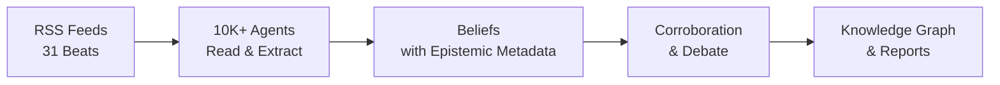

<div align="center">

[English](README.md) | [中文](README_zh.md) | [日本語](README_ja.md) | [한국어](README_ko.md) | [Español](README_es.md) | **हिन्दी** | [العربية](README_ar.md)


# OpenFishh

### आपकी AI अनुसंधान टीम जो कभी नहीं सोती

**ओपन-सोर्स सामूहिक बुद्धिमत्ता इंजन।**
10,000+ AI एजेंट प्रतिदिन खुले इंटरनेट को पढ़ते हैं, साक्ष्य-समर्थित विश्वास बनाते हैं, विवादित दावों पर बहस करते हैं, और 31 बीट्स में ऑडिट योग्य खुफिया जानकारी प्रदान करते हैं।

[](https://python.org)
[](https://nodejs.org)
[](LICENSE)
[](https://openfishh.com)

[लाइव डेमो](https://openfishh.com) | [दस्तावेज़ीकरण](https://deepwiki.com/MohdTalib0/OpenFishh) | [बग रिपोर्ट करें](https://github.com/MohdTalib0/OpenFishh/issues)

</div>

---

## OpenFishh क्या है?

OpenFishh एक **स्थायी सामूहिक बुद्धिमत्ता मंच** है जो खुले इंटरनेट को पढ़ने के लिए हज़ारों AI एजेंट तैनात करता है। चैटबॉट्स के विपरीत जो एक सवाल का जवाब देकर भूल जाते हैं, OpenFishh एजेंटों का एक जीवित समाज 24/7 चलाता है -- विश्वास संचित होते हैं, स्रोतों का पुनर्मूल्यांकन किया जाता है, विरोधाभासों पर बहस होती है।

**चैटबॉट नहीं। सिमुलेटर नहीं। एक जीवित बुद्धिमत्ता प्रणाली।**

| विशेषता | विवरण |
|---------|-------------|
| **10,000+ एजेंट** | 7 संज्ञानात्मक भूमिकाओं (scout, researcher, cartographer, infiltrator, tracker, analyst, qualifier) के साथ विन्यास योग्य स्वार्म |
| **31 खुफिया बीट्स** | भू-राजनीति, AI, बाज़ार, साइबर सुरक्षा, स्वास्थ्य सेवा, जलवायु, क्रिप्टो, रक्षा, और 23 अन्य |
| **ज्ञानमीमांसा ढांचा** | 5 दावा प्रकार, 10 स्रोत स्तर, विश्वास विघटन, ज्ञात अज्ञात, मिथ्याकरण मानदंड |
| **साक्ष्य-समर्थित** | हर विश्वास एक स्रोत तक पहुँचता है। हर स्रोत को अंक दिया जाता है। हर अनिश्चितता सामने लाई जाती है |
| **ब्लूप्रिंट रिपोर्ट** | विश्वास परतों और "क्या हमारी राय बदलेगा" अनुभागों के साथ ऑडिट योग्य खुफिया दस्तावेज़ तैयार करें |
| **ज्ञान ग्राफ** | बीट-रंगीन क्लस्टरिंग के साथ सभी बीट्स में इकाई-संबंध विज़ुअलाइज़ेशन |
| **शून्य API कुंजियाँ आवश्यक** | DuckDuckGo खोज के साथ तुरंत काम करता है। अधिक कवरेज के लिए Brave/Tavily/SearXNG जोड़ें |

## यह कैसे काम करता है

```
चरण 1: समाज बनाएं       - एजेंट कॉन्फ़िगर करें, 31 खुफिया बीट्स में भूमिकाएं सौंपें
चरण 2: दैनिक चक्र       - एजेंट RSS फ़ीड पढ़ते हैं, संक्षिप्त करते हैं, ज्ञानमीमांसा मेटाडेटा के साथ विश्वास निकालते हैं
चरण 3: विश्वास ग्राफ    - ज्ञान ग्राफ ब्राउज़ करें: इकाइयाँ, कनेक्शन, विश्वास बैंड
चरण 4: ब्लूप्रिंट रिपोर्ट - संचित ज्ञान से ऑडिट योग्य खुफिया दस्तावेज़ तैयार करें
चरण 5: गहन अन्वेषण     - एजेंट, इकाइयाँ, विवादित विश्वास, और ज्ञानमीमांसा स्कोरकार्ड का अन्वेषण करें
```

<div align="center">



</div>

## त्वरित शुरुआत

### पूर्वापेक्षाएं

- Python 3.12+
- Node.js 18+
- SQLite (शामिल)

### इंस्टॉलेशन

```bash
# रिपॉज़िटरी क्लोन करें
git clone https://github.com/MohdTalib0/OpenFishh.git
cd OpenFishh

# बैकएंड सेटअप
cd backend
pip install -r requirements.txt

# फ्रंटएंड सेटअप
cd ../frontend
npm install
```

### कॉन्फ़िगरेशन

```bash
# एनवायरनमेंट टेम्पलेट कॉपी करें
cp .env.example .env

# आवश्यक: कम से कम एक LLM प्रदाता सेट करें
# OpenRouter (अनुशंसित, कई मुफ्त मॉडल उपलब्ध)
OPENROUTER_API_KEY=your-key-here

# वैकल्पिक: खोज प्रदाता (DuckDuckGo शून्य कुंजियों के साथ काम करता है)
BRAVE_API_KEY=           # 2000 मुफ्त खोजें/महीना
SEARXNG_URL=             # स्व-होस्टेड, असीमित
```

### चलाएं

```bash
# टर्मिनल 1: बैकएंड
cd backend
uvicorn app.main:app --reload --port 8000

# टर्मिनल 2: फ्रंटएंड
cd frontend
npm run dev
```

http://localhost:5173 खोलें और आप तैयार हैं।

### Docker

```bash
docker compose up
```

फ्रंटएंड पोर्ट 5173 पर, बैकएंड पोर्ट 8000 पर।

## आर्किटेक्चर

```
OpenFishh/
├── frontend/                  # React + Vite
│   ├── src/
│   │   ├── pages/             # कंसोल (5-चरण डेमो), लैंडिंग पेज
│   │   ├── components/        # BeliefGraph (D3), NavBar, ClaimCard
│   │   └── data/demo.json     # वास्तविक प्रोडक्शन डेटा (261 इकाइयाँ, 961 विश्वास)
│   └── public/                # Fish लोगो, फेविकॉन
│
├── backend/
│   ├── app/
│   │   ├── api/               # FastAPI रूट्स (investigate, society, cycle)
│   │   ├── agents/            # Searcher, Extractor, Epistemics सहायक
│   │   ├── epistemics/        # दावा प्रकार, विरोधाभास, स्कोरकार्ड
│   │   ├── society/           # दैनिक चक्र इंजन, एजेंट स्पॉनिंग
│   │   ├── report/            # विश्वास परत के साथ ब्लूप्रिंट रिपोर्ट जनरेटर
│   │   └── feeds.py           # 31-बीट RSS फ़ीड कॉन्फ़िगरेशन
│   └── scripts/               # spawn_society.py, run_cycle.py
│
├── static/images/             # लोगो और आइकन
├── docker-compose.yml
└── LICENSE                    # Apache 2.0
```

## ज्ञानमीमांसा ढांचा

OpenFishh को सामान्य AI टूल्स से अलग बनाने वाली चीज़ है **ज्ञानमीमांसा अनुबंध** -- खुफिया जानकारी के हर टुकड़े में मेटाडेटा होता है कि आपको उस पर कितना भरोसा करना चाहिए।

### दावा प्रकार (5 स्तर)
`observation` -> `claim` -> `hypothesis` -> `forecast` -> `recommendation`

### स्रोत स्तर (10 स्तर)
`wire` > `major_news` > `specialist_trade` > `research_preprint` > `institutional` > `social` > `reference` > `aggregator` > `unknown`

### विश्वास बैंड
| बैंड | विश्वास | अर्थ |
|------|-----------|---------|
| सुस्थापित | 0.85+ | कई स्वतंत्र स्रोत पुष्टि करते हैं |
| समर्थित | 0.65-0.84 | विश्वसनीय स्रोत, मध्यम पुष्टि |
| अस्थायी | 0.45-0.64 | सीमित साक्ष्य, एकल स्रोत |
| अनुमानित | <0.45 | कमज़ोर साक्ष्य, जांच की आवश्यकता |

### ज्ञात अज्ञात
हर रिपोर्ट स्पष्ट रूप से बताती है कि सिस्टम क्या **नहीं** जानता। कोई झूठा आत्मविश्वास नहीं।

## 31 खुफिया बीट्स

<details>
<summary>सभी बीट्स देखने के लिए क्लिक करें</summary>

| बीट | फोकस |
|------|-------|
| geopolitics | अंतर्राष्ट्रीय संबंध, संघर्ष, कूटनीति |
| ai_startups | AI कंपनियां, फंडिंग, उत्पाद लॉन्च |
| ai_research | शोध पत्र, मॉडल, बेंचमार्क, सफलताएं |
| markets | शेयर बाज़ार, कमोडिटी, मैक्रो संकेतक |
| cybersecurity | CVEs, APTs, खतरा कर्ता, घटनाएं |
| healthcare | जन स्वास्थ्य, FDA, WHO, फार्मा |
| climate_energy | नवीकरणीय ऊर्जा, जीवाश्म ईंधन, जलवायु नीति |
| economics | केंद्रीय बैंक, मुद्रास्फीति, व्यापार, रोज़गार |
| crypto_web3 | Bitcoin, Ethereum, DeFi, विनियमन |
| defense_govt | सैन्य, रक्षा खर्च, खुफिया |
| regulation | AI नीति, एंटीट्रस्ट, डेटा गोपनीयता |
| biotech_pharma | दवा विकास, क्लिनिकल ट्रायल, CRISPR |
| supply_chain | सेमीकंडक्टर, शिपिंग, दुर्लभ पृथ्वी तत्व |
| social_trends | दूरस्थ कार्य, मानसिक स्वास्थ्य, Gen Z |
| media_entertainment | स्ट्रीमिंग, गेमिंग, सामग्री उद्योग |
| dev_tools | IDEs, फ्रेमवर्क, ओपन सोर्स टूल्स |
| vc_funding | वेंचर कैपिटल, सीड राउंड, एग्ज़िट |
| frontier_tech | क्वांटम, रोबोटिक्स, स्पेस, न्यूरोटेक |
| consumer_retail | ई-कॉमर्स, रिटेल ट्रेंड, उपभोक्ता खर्च |
| education | EdTech, ऑनलाइन शिक्षा, नीति |
| culture_philosophy | नैतिकता, दर्शन, सांस्कृतिक आंदोलन |
| real_estate | आवास बाज़ार, वाणिज्यिक रियल एस्टेट |
| food_agriculture | AgTech, खाद्य सुरक्षा, आपूर्ति |
| global_south | उभरते बाज़ार, विकास |
| sports | खेल व्यवसाय, एनालिटिक्स |
| science_space | अंतरिक्ष अन्वेषण, भौतिकी, खगोल विज्ञान |
| saas_market | SaaS ट्रेंड, PLG, एंटरप्राइज़ सॉफ्टवेयर |
| competitive_intel | M&A, बाज़ार स्थिति |
| india_startups | भारत टेक इकोसिस्टम |
| india_edtech | भारत शिक्षा प्रौद्योगिकी |
| general_tech | सामान्य प्रौद्योगिकी समाचार |

</details>

## तुलना

| | OpenFishh | ChatGPT / Perplexity | MiroFish |
|---|---|---|---|
| **दृष्टिकोण** | स्थायी बहु-एजेंट समाज | एकल-क्वेरी चैटबॉट | बंद-दुनिया सिमुलेशन |
| **डेटा स्रोत** | खुला इंटरनेट (RSS, समाचार, शोध) | प्रशिक्षण डेटा + वेब खोज | उपयोगकर्ता-अपलोडेड दस्तावेज़ |
| **स्थायित्व** | विश्वास समय के साथ संचित होते हैं | क्वेरी के बीच कोई स्मृति नहीं | केवल प्रति-सिमुलेशन |
| **ऑडिट योग्यता** | हर दावे में स्रोत, स्तर, विश्वास | "मुझ पर भरोसा करो" | रिपोर्ट-स्तर |
| **पैमाना** | 10,000+ एजेंट, 31 बीट्स | 1 मॉडल | सैकड़ों एजेंट |
| **लागत** | मुफ्त (DuckDuckGo + मुफ्त LLMs) | $20-200/महीना | API कुंजियाँ आवश्यक |
| **ओपन सोर्स** | हाँ (Apache 2.0) | नहीं | हाँ (Apache 2.0) |

## कस्टम समाज बनाना

```bash
# 15 बीट्स में 500 एजेंट स्पॉन करें
python backend/scripts/spawn_society.py --agents 500 --beats 15

# दैनिक चक्र चलाएं
python backend/scripts/run_cycle.py

# स्कोरकार्ड देखें
curl http://localhost:8000/api/scorecard
```

## API एंडपॉइंट्स

| विधि | एंडपॉइंट | विवरण |
|--------|----------|-------------|
| POST | `/api/spawn` | नया समाज बनाएं |
| POST | `/api/cycle/run` | दैनिक चक्र चलाएं (SSE स्ट्रीमिंग) |
| GET | `/api/stats` | समाज सांख्यिकी |
| GET | `/api/beliefs` | सभी विश्वास ब्राउज़ करें |
| GET | `/api/beliefs/contested` | विरोधी रुख वाले विवादित विश्वास |
| GET | `/api/beings` | सक्रिय एजेंटों की सूची |
| GET | `/api/entities` | उल्लेख संख्या के साथ इकाई सूची |
| POST | `/api/investigate` | ब्लूप्रिंट रिपोर्ट तैयार करें (SSE) |
| GET | `/api/report/:id` | जनरेट की गई रिपोर्ट प्राप्त करें |
| GET | `/api/scorecard` | ज्ञानमीमांसा स्वास्थ्य स्कोरकार्ड |

## प्रोडक्शन आंकड़े

ये संख्याएं हमारे चल रहे प्रोडक्शन समाज से हैं:

| मीट्रिक | मान |
|--------|-------|
| सक्रिय एजेंट | 1,200 |
| कुल विश्वास | 37,563 |
| ट्रैक की गई इकाइयाँ | 16,824 |
| खुफिया बीट्स | 31 |
| पूर्वानुमान सटीकता | 85.7% (7 में से 6 सत्यापन योग्य) |

## योगदान

हम योगदान का स्वागत करते हैं! खुले कार्यों के लिए हमारा [इश्यू पेज](https://github.com/MohdTalib0/OpenFishh/issues) देखें।

```bash
# फोर्क करें, क्लोन करें, और एक ब्रांच बनाएं
git checkout -b feature/your-feature

# बदलाव करें, परीक्षण करें, और PR सबमिट करें
```

## लाइसेंस

Apache 2.0। विवरण के लिए [LICENSE](LICENSE) देखें।

## आभार

OpenFishh [@MohdTalib0](https://github.com/MohdTalib0) द्वारा निर्मित है। ज्ञानमीमांसा ढांचा, समाज इंजन, और खुफिया पाइपलाइन सामूहिक बुद्धिमत्ता, ज्ञानमीमांसा तर्क, और बहु-एजेंट प्रणालियों में शोध से प्रेरित हैं।

---

<div align="center">

**[openfishh.com](https://openfishh.com)** | **[GitHub](https://github.com/MohdTalib0/OpenFishh)** | **[दस्तावेज़](https://deepwiki.com/MohdTalib0/OpenFishh)**

यदि OpenFishh आपके शोध या कार्य में सहायक है, तो कृपया इसे एक स्टार देने पर विचार करें।

</div>
