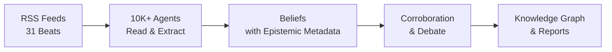

<div align="center">

[English](README.md) | [中文](README_zh.md) | **日本語** | [한국어](README_ko.md) | [Español](README_es.md) | [हिन्दी](README_hi.md) | [العربية](README_ar.md)


# OpenFishh

### 眠らないAIリサーチチーム

**オープンソースの集合知エンジン。**
10,000以上のAIエージェントがオープンインターネットを毎日読み取り、エビデンスに基づく信念を形成し、対立する主張を議論し、31の情報分野にわたって監査可能なインテリジェンスを提供します。

[](https://python.org)
[](https://nodejs.org)
[](LICENSE)
[](https://openfishh.com)

[ライブデモ](https://openfishh.com) | [ドキュメント](https://deepwiki.com/MohdTalib0/OpenFishh) | [バグ報告](https://github.com/MohdTalib0/OpenFishh/issues)

</div>

---

## OpenFishhとは？

OpenFishhは、数千のAIエージェントを展開してオープンインターネットを読み取る**永続的な集合知プラットフォーム**です。1つの質問に答えて忘れてしまうチャットボットとは異なり、OpenFishhはエージェントの生きた社会を24時間365日運営します。信念は蓄積され、情報源は再評価され、矛盾は議論されます。

**チャットボットではない。シミュレーターでもない。生きたインテリジェンスシステムです。**

| 機能 | 説明 |
|------|------|
| **10,000以上のエージェント** | 7つの認知的役割（scout、researcher、cartographer、infiltrator、tracker、analyst、qualifier）を持つ構成可能なスウォーム |
| **31の情報分野** | 地政学、AI、市場、サイバーセキュリティ、医療、気候、暗号資産、防衛、その他23分野 |
| **認識論フレームワーク** | 5つの主張タイプ、10の情報源ティア、信頼度分解、既知の未知、反証基準 |
| **エビデンスに基づく** | すべての信念は情報源まで遡及可能。すべての情報源はスコアリング済み。すべての不確実性が表面化 |
| **Blueprintレポート** | 信頼レイヤーと「何が考えを変えるか」セクションを備えた監査可能なインテリジェンスレポートを生成 |
| **ナレッジグラフ** | 分野別に色分けされたクラスタリングによる、全分野にわたるエンティティ関係の可視化 |
| **APIキー不要** | DuckDuckGo検索ですぐに動作。Brave/Tavily/SearXNGを追加してカバレッジを拡大可能 |

## 仕組み

```
ステップ1: 社会を生成     - エージェントを構成し、31の情報分野に役割を割り当てる
ステップ2: デイリーサイクル - エージェントがRSSフィードを読み取り、圧縮し、認識論メタデータとともに信念を抽出
ステップ3: 信念グラフ     - ナレッジグラフを閲覧：エンティティ、接続、信頼度帯域
ステップ4: Blueprintレポート - 蓄積された知識から監査可能なインテリジェンスレポートを生成
ステップ5: 深層探索       - エージェント、エンティティ、対立する信念、認識論スコアカードを探索
```

<div align="center">



</div>

## クイックスタート

### 前提条件

- Python 3.12+
- Node.js 18+
- SQLite（同梱）

### インストール

```bash
# リポジトリをクローン
git clone https://github.com/MohdTalib0/OpenFishh.git
cd OpenFishh

# バックエンドのセットアップ
cd backend
pip install -r requirements.txt

# フロントエンドのセットアップ
cd ../frontend
npm install
```

### 設定

```bash
# 環境テンプレートをコピー
cp .env.example .env

# 必須: 少なくとも1つのLLMプロバイダーを設定
# OpenRouter（推奨、多数の無料モデルあり）
OPENROUTER_API_KEY=your-key-here

# オプション: 検索プロバイダー（DuckDuckGoはキー不要で動作）
BRAVE_API_KEY=           # 月2000回の無料検索
SEARXNG_URL=             # セルフホスト、無制限
```

### 実行

```bash
# ターミナル1: バックエンド
cd backend
uvicorn app.main:app --reload --port 8000

# ターミナル2: フロントエンド
cd frontend
npm run dev
```

http://localhost:5173 を開けば準備完了です。

### Docker

```bash
docker compose up
```

フロントエンドはポート5173、バックエンドはポート8000で起動します。

## アーキテクチャ

```
OpenFishh/
├── frontend/                  # React + Vite
│   ├── src/
│   │   ├── pages/             # コンソール（5ステップデモ）、ランディングページ
│   │   ├── components/        # BeliefGraph (D3)、NavBar、ClaimCard
│   │   └── data/demo.json     # 本番データ（261エンティティ、961信念）
│   └── public/                # Fishロゴ、ファビコン
│
├── backend/
│   ├── app/
│   │   ├── api/               # FastAPIルート（investigate、society、cycle）
│   │   ├── agents/            # Searcher、Extractor、Epistemicsヘルパー
│   │   ├── epistemics/        # 主張タイプ、矛盾、スコアカード
│   │   ├── society/           # デイリーサイクルエンジン、エージェント生成
│   │   ├── report/            # 信頼レイヤー付きBlueprintレポートジェネレーター
│   │   └── feeds.py           # 31分野のRSSフィード設定
│   └── scripts/               # spawn_society.py、run_cycle.py
│
├── static/images/             # ロゴとアイコン
├── docker-compose.yml
└── LICENSE                    # Apache 2.0
```

## 認識論フレームワーク

OpenFishhが一般的なAIツールと異なるのは、**認識論的契約**です。すべてのインテリジェンスに、それをどの程度信頼すべきかについてのメタデータが付随しています。

### 主張タイプ（5段階）
`observation` -> `claim` -> `hypothesis` -> `forecast` -> `recommendation`

### 情報源ティア（10段階）
`wire` > `major_news` > `specialist_trade` > `research_preprint` > `institutional` > `social` > `reference` > `aggregator` > `unknown`

### 信頼度帯域
| 帯域 | 信頼度 | 意味 |
|------|--------|------|
| 十分な裏付け | 0.85以上 | 複数の独立した情報源が確認 |
| 裏付けあり | 0.65-0.84 | 信頼できる情報源、中程度の裏付け |
| 暫定的 | 0.45-0.64 | 限定的なエビデンス、単一の情報源 |
| 推測的 | 0.45未満 | 弱いエビデンス、調査が必要 |

### 既知の未知
すべてのレポートは、システムが**知らないこと**を明示的に記述します。偽りの確信はありません。

## 31の情報分野

<details>
<summary>すべての分野を展開するにはクリック</summary>

| 分野 | 焦点 |
|------|------|
| geopolitics | 国際関係、紛争、外交 |
| ai_startups | AI企業、資金調達、製品ローンチ |
| ai_research | 論文、モデル、ベンチマーク、ブレークスルー |
| markets | 株式市場、コモディティ、マクロ指標 |
| cybersecurity | CVE、APT、脅威アクター、インシデント |
| healthcare | 公衆衛生、FDA、WHO、製薬 |
| climate_energy | 再生可能エネルギー、化石燃料、気候政策 |
| economics | 中央銀行、インフレ、貿易、雇用 |
| crypto_web3 | Bitcoin、Ethereum、DeFi、規制 |
| defense_govt | 軍事、防衛支出、インテリジェンス |
| regulation | AI政策、独占禁止法、データプライバシー |
| biotech_pharma | 新薬開発、臨床試験、CRISPR |
| supply_chain | 半導体、海運、レアアース |
| social_trends | リモートワーク、メンタルヘルス、Z世代 |
| media_entertainment | ストリーミング、ゲーミング、コンテンツ業界 |
| dev_tools | IDE、フレームワーク、オープンソースツール |
| vc_funding | ベンチャーキャピタル、シードラウンド、エグジット |
| frontier_tech | 量子技術、ロボティクス、宇宙、ニューロテック |
| consumer_retail | Eコマース、小売トレンド、消費者支出 |
| education | EdTech、オンライン学習、政策 |
| culture_philosophy | 倫理、哲学、文化運動 |
| real_estate | 住宅市場、商業不動産 |
| food_agriculture | AgTech、食料安全保障、供給 |
| global_south | 新興市場、開発 |
| sports | スポーツビジネス、アナリティクス |
| science_space | 宇宙探査、物理学、天文学 |
| saas_market | SaaSトレンド、PLG、エンタープライズソフトウェア |
| competitive_intel | M&A、市場ポジショニング |
| india_startups | インドのテックエコシステム |
| india_edtech | インドの教育テクノロジー |
| general_tech | 幅広いテクノロジーニュース |

</details>

## 比較

| | OpenFishh | ChatGPT / Perplexity | MiroFish |
|---|---|---|---|
| **アプローチ** | 永続的なマルチエージェント社会 | 単発クエリのチャットボット | クローズドワールドシミュレーション |
| **データソース** | オープンインターネット（RSS、ニュース、研究） | 学習データ + Web検索 | ユーザーアップロードドキュメント |
| **永続性** | 信念が時間とともに蓄積 | クエリ間の記憶なし | シミュレーション単位のみ |
| **監査可能性** | すべての主張に情報源、ティア、信頼度あり | 「信じてください」 | レポートレベル |
| **スケール** | 10,000以上のエージェント、31分野 | 1モデル | 数百のエージェント |
| **コスト** | 無料（DuckDuckGo + 無料LLM） | 月額$20-200 | APIキーが必要 |
| **オープンソース** | はい（Apache 2.0） | いいえ | はい（Apache 2.0） |

## カスタム社会の生成

```bash
# 15分野にわたる500エージェントを生成
python backend/scripts/spawn_society.py --agents 500 --beats 15

# デイリーサイクルを実行
python backend/scripts/run_cycle.py

# スコアカードを表示
curl http://localhost:8000/api/scorecard
```

## APIエンドポイント

| メソッド | エンドポイント | 説明 |
|----------|---------------|------|
| POST | `/api/spawn` | 新しい社会を生成 |
| POST | `/api/cycle/run` | デイリーサイクルを実行（SSEストリーミング） |
| GET | `/api/stats` | 社会の統計情報 |
| GET | `/api/beliefs` | すべての信念を閲覧 |
| GET | `/api/beliefs/contested` | 対立する立場を持つ争点の信念 |
| GET | `/api/beings` | アクティブなエージェント一覧 |
| GET | `/api/entities` | 言及回数付きエンティティ一覧 |
| POST | `/api/investigate` | Blueprintレポートを生成（SSE） |
| GET | `/api/report/:id` | 生成済みレポートを取得 |
| GET | `/api/scorecard` | 認識論的健全性スコアカード |

## 本番環境の統計

以下は、稼働中の本番社会からの数値です：

| 指標 | 値 |
|------|-----|
| アクティブエージェント数 | 1,200 |
| 総信念数 | 37,563 |
| 追跡エンティティ数 | 16,824 |
| 情報分野数 | 31 |
| 予測精度 | 85.7%（検証可能な7件中6件） |

## コントリビューション

コントリビューションを歓迎します！オープンなタスクについては[Issuesページ](https://github.com/MohdTalib0/OpenFishh/issues)をご覧ください。

```bash
# フォーク、クローン、ブランチを作成
git checkout -b feature/your-feature

# 変更を加え、テストし、PRを提出
```

## ライセンス

Apache 2.0。詳細は[LICENSE](LICENSE)をご覧ください。

## 謝辞

OpenFishhは[@MohdTalib0](https://github.com/MohdTalib0)によって構築されています。認識論フレームワーク、社会エンジン、インテリジェンスパイプラインは、集合知、認識論理学、マルチエージェントシステムの研究に基づいています。

---

<div align="center">

**[openfishh.com](https://openfishh.com)** | **[GitHub](https://github.com/MohdTalib0/OpenFishh)** | **[Docs](https://deepwiki.com/MohdTalib0/OpenFishh)**

OpenFishhがあなたの研究や仕事に役立った場合は、スターの付与をご検討ください。

</div>
