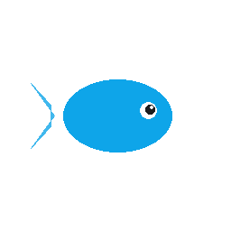
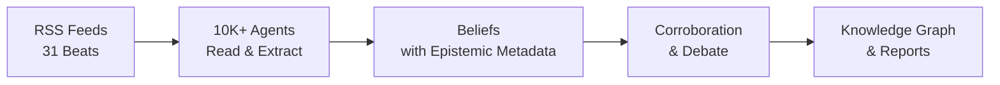

<div align="center">

[English](README.md) | [中文](README_zh.md) | [日本語](README_ja.md) | **한국어** | [Español](README_es.md) | [हिन्दी](README_hi.md) | [العربية](README_ar.md)



# OpenFishh

### 잠들지 않는 AI 리서치 팀

**오픈소스 집단 지능 엔진.**
10,000개 이상의 AI 에이전트가 매일 공개 인터넷을 읽고, 증거 기반의 신념을 형성하며, 논쟁적인 주장을 토론하고, 31개 분야에 걸쳐 감사 가능한 인텔리전스를 제공합니다.

[](https://python.org)
[](https://nodejs.org)
[](LICENSE)
[](https://openfishh.com)

[라이브 데모](https://openfishh.com) | [문서](https://deepwiki.com/MohdTalib0/OpenFishh) | [버그 신고](https://github.com/MohdTalib0/OpenFishh/issues)

</div>

---

## OpenFishh란?

OpenFishh는 수천 개의 AI 에이전트를 배치하여 공개 인터넷을 읽는 **지속적 집단 지능 플랫폼**입니다. 하나의 질문에 답하고 잊어버리는 챗봇과 달리, OpenFishh는 24시간 연중무휴로 살아 있는 에이전트 사회를 운영합니다 -- 신념은 축적되고, 출처는 재평가되며, 모순은 토론됩니다.

**챗봇이 아닙니다. 시뮬레이터가 아닙니다. 살아 있는 지능 시스템입니다.**

| 기능 | 설명 |
|------|------|
| **10,000+ 에이전트** | 7가지 인지 역할(정찰병, 연구원, 지도 제작자, 침투자, 추적자, 분석가, 평가자)을 가진 구성 가능한 스웜 |
| **31개 인텔리전스 분야** | 지정학, AI, 시장, 사이버 보안, 의료, 기후, 암호화폐, 국방 등 23개 분야 추가 |
| **인식론적 프레임워크** | 5가지 주장 유형, 10단계 출처 등급, 신뢰도 분해, 알려진 미지수, 반증 기준 |
| **증거 기반** | 모든 신념은 출처로 추적 가능. 모든 출처는 점수화. 모든 불확실성은 표면화 |
| **블루프린트 보고서** | 신뢰 계층과 "무엇이 우리의 판단을 바꿀 수 있는가" 섹션이 포함된 감사 가능한 인텔리전스 보고서 생성 |
| **지식 그래프** | 분야별 색상 클러스터링을 통한 모든 분야의 엔티티-관계 시각화 |
| **API 키 불필요** | DuckDuckGo 검색으로 즉시 작동. Brave/Tavily/SearXNG 추가로 더 넓은 범위 확보 가능 |

## 작동 방식

```
1단계: 사회 생성      - 에이전트를 구성하고 31개 인텔리전스 분야에 역할 배정
2단계: 일일 사이클     - 에이전트가 RSS 피드를 읽고, 압축하고, 인식론적 메타데이터와 함께 신념 추출
3단계: 신념 그래프     - 지식 그래프 탐색: 엔티티, 연결, 신뢰도 범위
4단계: 블루프린트 보고서 - 축적된 지식으로부터 감사 가능한 인텔리전스 보고서 생성
5단계: 심층 탐색       - 에이전트, 엔티티, 논쟁적 신념, 인식론적 성과표 탐색
```

<div align="center">



</div>

## 빠른 시작

### 사전 요구 사항

- Python 3.12+
- Node.js 18+
- SQLite (기본 포함)

### 설치

```bash
# 저장소 클론
git clone https://github.com/MohdTalib0/OpenFishh.git
cd OpenFishh

# 백엔드 설정
cd backend
pip install -r requirements.txt

# 프론트엔드 설정
cd ../frontend
npm install
```

### 설정

```bash
# 환경 템플릿 복사
cp .env.example .env

# 필수: 최소 하나의 LLM 프로바이더 설정
# OpenRouter (권장, 다수의 무료 모델 사용 가능)
OPENROUTER_API_KEY=your-key-here

# 선택: 검색 프로바이더 (DuckDuckGo는 키 없이 작동)
BRAVE_API_KEY=           # 월 2,000회 무료 검색
SEARXNG_URL=             # 자체 호스팅, 무제한
```

### 실행

```bash
# 터미널 1: 백엔드
cd backend
uvicorn app.main:app --reload --port 8000

# 터미널 2: 프론트엔드
cd frontend
npm run dev
```

http://localhost:5173 을 열면 바로 사용할 수 있습니다.

### Docker

```bash
docker compose up
```

프론트엔드는 포트 5173, 백엔드는 포트 8000에서 실행됩니다.

## 아키텍처

```
OpenFishh/
├── frontend/                  # React + Vite
│   ├── src/
│   │   ├── pages/             # 콘솔 (5단계 데모), 랜딩 페이지
│   │   ├── components/        # BeliefGraph (D3), NavBar, ClaimCard
│   │   └── data/demo.json     # 실제 프로덕션 데이터 (261개 엔티티, 961개 신념)
│   └── public/                # 물고기 로고, 파비콘
│
├── backend/
│   ├── app/
│   │   ├── api/               # FastAPI 라우트 (investigate, society, cycle)
│   │   ├── agents/            # Searcher, Extractor, Epistemics 헬퍼
│   │   ├── epistemics/        # 주장 유형, 모순, 성과표
│   │   ├── society/           # 일일 사이클 엔진, 에이전트 생성
│   │   ├── report/            # 신뢰 계층이 포함된 블루프린트 보고서 생성기
│   │   └── feeds.py           # 31개 분야 RSS 피드 설정
│   └── scripts/               # spawn_society.py, run_cycle.py
│
├── static/images/             # 로고 및 아이콘
├── docker-compose.yml
└── LICENSE                    # Apache 2.0
```

## 인식론적 프레임워크

OpenFishh가 일반적인 AI 도구와 다른 점은 **인식론적 계약**입니다 -- 모든 인텔리전스에는 얼마나 신뢰해야 하는지에 대한 메타데이터가 포함되어 있습니다.

### 주장 유형 (5단계)
`observation` -> `claim` -> `hypothesis` -> `forecast` -> `recommendation`

### 출처 등급 (10단계)
`wire` > `major_news` > `specialist_trade` > `research_preprint` > `institutional` > `social` > `reference` > `aggregator` > `unknown`

### 신뢰도 구간
| 구간 | 신뢰도 | 의미 |
|------|--------|------|
| 강력한 근거 | 0.85+ | 여러 독립적인 출처가 확인 |
| 근거 있음 | 0.65-0.84 | 신뢰할 수 있는 출처, 중간 수준의 확증 |
| 잠정적 | 0.45-0.64 | 제한된 증거, 단일 출처 |
| 추측성 | <0.45 | 약한 증거, 조사 필요 |

### 알려진 미지수
모든 보고서는 시스템이 **모르는 것**을 명시적으로 기술합니다. 거짓 확신은 없습니다.

## 31개 인텔리전스 분야

<details>
<summary>전체 분야 목록 펼치기</summary>

| 분야 | 초점 |
|------|------|
| geopolitics | 국제 관계, 분쟁, 외교 |
| ai_startups | AI 기업, 투자, 제품 출시 |
| ai_research | 논문, 모델, 벤치마크, 혁신적 발견 |
| markets | 주식 시장, 원자재, 거시 지표 |
| cybersecurity | CVE, APT, 위협 행위자, 사건 |
| healthcare | 공중 보건, FDA, WHO, 제약 |
| climate_energy | 재생 에너지, 화석 연료, 기후 정책 |
| economics | 중앙은행, 인플레이션, 무역, 고용 |
| crypto_web3 | Bitcoin, Ethereum, DeFi, 규제 |
| defense_govt | 군사, 국방 지출, 정보 기관 |
| regulation | AI 정책, 반독점, 데이터 프라이버시 |
| biotech_pharma | 신약 개발, 임상 시험, CRISPR |
| supply_chain | 반도체, 해운, 희토류 |
| social_trends | 원격 근무, 정신 건강, Z세대 |
| media_entertainment | 스트리밍, 게이밍, 콘텐츠 산업 |
| dev_tools | IDE, 프레임워크, 오픈소스 도구 |
| vc_funding | 벤처 캐피탈, 시드 라운드, 엑싯 |
| frontier_tech | 양자 컴퓨팅, 로보틱스, 우주, 뉴로테크 |
| consumer_retail | 이커머스, 소매 트렌드, 소비자 지출 |
| education | EdTech, 온라인 학습, 정책 |
| culture_philosophy | 윤리, 철학, 문화 운동 |
| real_estate | 주택 시장, 상업용 부동산 |
| food_agriculture | AgTech, 식량 안보, 공급 |
| global_south | 신흥 시장, 개발 |
| sports | 스포츠 비즈니스, 분석 |
| science_space | 우주 탐사, 물리학, 천문학 |
| saas_market | SaaS 트렌드, PLG, 기업용 소프트웨어 |
| competitive_intel | M&A, 시장 포지셔닝 |
| india_startups | 인도 기술 생태계 |
| india_edtech | 인도 교육 기술 |
| general_tech | 종합 기술 뉴스 |

</details>

## 비교

| | OpenFishh | ChatGPT / Perplexity | MiroFish |
|---|---|---|---|
| **접근 방식** | 지속적 다중 에이전트 사회 | 단일 쿼리 챗봇 | 폐쇄형 시뮬레이션 |
| **데이터 소스** | 공개 인터넷 (RSS, 뉴스, 연구) | 학습 데이터 + 웹 검색 | 사용자 업로드 문서 |
| **지속성** | 신념이 시간이 지남에 따라 축적 | 쿼리 간 기억 없음 | 시뮬레이션 단위만 |
| **감사 가능성** | 모든 주장에 출처, 등급, 신뢰도 포함 | "저를 믿으세요" | 보고서 수준 |
| **규모** | 10,000+ 에이전트, 31개 분야 | 1개 모델 | 수백 개의 에이전트 |
| **비용** | 무료 (DuckDuckGo + 무료 LLM) | $20-200/월 | API 키 필요 |
| **오픈소스** | 예 (Apache 2.0) | 아니오 | 예 (Apache 2.0) |

## 커스텀 사회 생성

```bash
# 15개 분야에 500개 에이전트 생성
python backend/scripts/spawn_society.py --agents 500 --beats 15

# 일일 사이클 실행
python backend/scripts/run_cycle.py

# 성과표 확인
curl http://localhost:8000/api/scorecard
```

## API 엔드포인트

| 메서드 | 엔드포인트 | 설명 |
|--------|-----------|------|
| POST | `/api/spawn` | 새로운 사회 생성 |
| POST | `/api/cycle/run` | 일일 사이클 실행 (SSE 스트리밍) |
| GET | `/api/stats` | 사회 통계 |
| GET | `/api/beliefs` | 모든 신념 조회 |
| GET | `/api/beliefs/contested` | 반대 입장이 있는 논쟁적 신념 |
| GET | `/api/beings` | 활성 에이전트 목록 |
| GET | `/api/entities` | 언급 횟수가 포함된 엔티티 목록 |
| POST | `/api/investigate` | 블루프린트 보고서 생성 (SSE) |
| GET | `/api/report/:id` | 생성된 보고서 조회 |
| GET | `/api/scorecard` | 인식론적 건강 성과표 |

## 프로덕션 통계

다음은 현재 운영 중인 프로덕션 사회의 수치입니다:

| 지표 | 값 |
|------|-----|
| 활성 에이전트 | 1,200 |
| 총 신념 수 | 37,563 |
| 추적 엔티티 수 | 16,824 |
| 인텔리전스 분야 | 31 |
| 예측 정확도 | 85.7% (검증 가능한 7건 중 6건) |

## 기여하기

기여를 환영합니다! 열린 작업은 [이슈 페이지](https://github.com/MohdTalib0/OpenFishh/issues)를 참조하세요.

```bash
# 포크, 클론 후 브랜치 생성
git checkout -b feature/your-feature

# 변경 사항을 작성하고, 테스트한 후 PR을 제출하세요
```

## 라이선스

Apache 2.0. 자세한 내용은 [LICENSE](LICENSE)를 참조하세요.

## 감사의 글

OpenFishh는 [@MohdTalib0](https://github.com/MohdTalib0)가 제작했습니다. 인식론적 프레임워크, 사회 엔진, 인텔리전스 파이프라인은 집단 지능, 인식론적 논리, 다중 에이전트 시스템 연구에 기반하고 있습니다.

---

<div align="center">

**[openfishh.com](https://openfishh.com)** | **[GitHub](https://github.com/MohdTalib0/OpenFishh)** | **[Docs](https://deepwiki.com/MohdTalib0/OpenFishh)**

OpenFishh가 연구나 업무에 도움이 되셨다면 별표를 남겨주세요.

</div>
