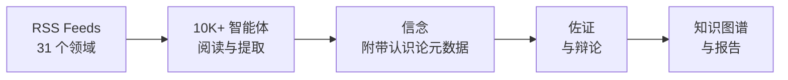

<div align="center">

[English](README.md) | **中文** | [日本語](README_ja.md) | [한국어](README_ko.md) | [Español](README_es.md) | [हिन्दी](README_hi.md) | [العربية](README_ar.md)


# OpenFishh

### 永不休眠的 AI 研究团队

**开源集体智能引擎。**
10,000+ AI 智能体每日阅读开放互联网，形成有证据支撑的信念，辩论有争议的主张，并在 31 个情报领域提供可审计的情报。

[](https://python.org)
[](https://nodejs.org)
[](LICENSE)
[](https://openfishh.com)

[在线演示](https://openfishh.com) | [文档](https://deepwiki.com/MohdTalib0/OpenFishh) | [报告问题](https://github.com/MohdTalib0/OpenFishh/issues)

</div>

---

## OpenFishh 是什么？

OpenFishh 是一个**持久化集体智能平台**，部署数千个 AI 智能体来阅读开放互联网。与回答完问题就遗忘的聊天机器人不同，OpenFishh 全天候运行一个由智能体组成的活态社会——信念不断积累，信息来源被反复评估，矛盾观点经过辩论。

**不是聊天机器人。不是模拟器。而是一个活的智能系统。**

| 特性 | 描述 |
|---------|-------------|
| **10,000+ 智能体** | 可配置的集群，包含 7 种认知角色（侦察兵、研究员、制图师、渗透者、追踪者、分析师、资质审核员） |
| **31 个情报领域** | 地缘政治、AI、市场、网络安全、医疗健康、气候、加密货币、国防，以及其他 23 个领域 |
| **认识论框架** | 5 种主张类型、10 级信息来源分层、置信度分解、已知的未知、证伪标准 |
| **证据支撑** | 每条信念都可追溯到来源。每个来源都有评分。每一处不确定性都被明确展示 |
| **蓝图报告** | 生成可审计的情报档案，包含信任层和"什么会改变我们的判断"章节 |
| **知识图谱** | 跨所有领域的实体关系可视化，按领域着色聚类 |
| **零 API 密钥即可运行** | 开箱即用 DuckDuckGo 搜索。可添加 Brave/Tavily/SearXNG 以获得更广覆盖 |

## 工作原理

```
第 1 步：创建社会    - 配置智能体，在 31 个情报领域中分配角色
第 2 步：每日循环    - 智能体阅读 RSS 订阅源，压缩内容，提取带有认识论元数据的信念
第 3 步：信念图谱    - 浏览知识图谱：实体、关联、置信度区间
第 4 步：蓝图报告    - 从积累的知识中生成可审计的情报档案
第 5 步：深度探索    - 探索智能体、实体、有争议的信念和认识论记分卡
```

<div align="center">



</div>

## 快速开始

### 前置条件

- Python 3.12+
- Node.js 18+
- SQLite（已内置）

### 安装

```bash
# 克隆仓库
git clone https://github.com/MohdTalib0/OpenFishh.git
cd OpenFishh

# 后端配置
cd backend
pip install -r requirements.txt

# 前端配置
cd ../frontend
npm install
```

### 配置

```bash
# 复制环境变量模板
cp .env.example .env

# 必需：至少设置一个 LLM 提供商
# OpenRouter（推荐，有很多免费模型可用）
OPENROUTER_API_KEY=your-key-here

# 可选：搜索引擎提供商（DuckDuckGo 无需任何密钥即可使用）
BRAVE_API_KEY=           # 每月 2000 次免费搜索
SEARXNG_URL=             # 自托管，无限制
```

### 运行

```bash
# 终端 1：后端
cd backend
uvicorn app.main:app --reload --port 8000

# 终端 2：前端
cd frontend
npm run dev
```

打开 http://localhost:5173 即可使用。

### Docker

```bash
docker compose up
```

前端端口 5173，后端端口 8000。

## 架构

```
OpenFishh/
├── frontend/                  # React + Vite
│   ├── src/
│   │   ├── pages/             # 控制台（5 步演示）、落地页
│   │   ├── components/        # BeliefGraph (D3)、NavBar、ClaimCard
│   │   └── data/demo.json     # 真实生产数据（261 个实体，961 条信念）
│   └── public/                # Fish 图标、网站图标
│
├── backend/
│   ├── app/
│   │   ├── api/               # FastAPI 路由（investigate、society、cycle）
│   │   ├── agents/            # Searcher、Extractor、Epistemics helper
│   │   ├── epistemics/        # 主张类型、矛盾检测、记分卡
│   │   ├── society/           # 每日循环引擎、智能体生成
│   │   ├── report/            # 蓝图报告生成器（含信任层）
│   │   └── feeds.py           # 31 个领域的 RSS 订阅源配置
│   └── scripts/               # spawn_society.py、run_cycle.py
│
├── static/images/             # 图标和标识
├── docker-compose.yml
└── LICENSE                    # Apache 2.0
```

## 认识论框架

OpenFishh 与通用 AI 工具的区别在于其**认识论契约**——每条情报都附带关于你应该多大程度信任它的元数据。

### 主张类型（5 个级别）
`observation` -> `claim` -> `hypothesis` -> `forecast` -> `recommendation`

### 信息来源分层（10 个级别）
`wire` > `major_news` > `specialist_trade` > `research_preprint` > `institutional` > `social` > `reference` > `aggregator` > `unknown`

### 置信度区间
| 区间 | 置信度 | 含义 |
|------|-----------|---------|
| 充分支持 | 0.85+ | 多个独立来源证实 |
| 有支持 | 0.65-0.84 | 可信来源，中等程度佐证 |
| 初步判断 | 0.45-0.64 | 有限证据，单一来源 |
| 推测性 | <0.45 | 证据薄弱，需要进一步调查 |

### 已知的未知
每份报告都明确说明系统**不知道**什么。绝不制造虚假的确定性。

## 31 个情报领域

<details>
<summary>点击展开所有领域</summary>

| 领域 | 关注焦点 |
|------|-------|
| geopolitics | 国际关系、冲突、外交 |
| ai_startups | AI 公司、融资、产品发布 |
| ai_research | 论文、模型、基准测试、突破性进展 |
| markets | 股票市场、大宗商品、宏观指标 |
| cybersecurity | CVE 漏洞、APT 组织、威胁行为者、安全事件 |
| healthcare | 公共卫生、FDA、WHO、制药 |
| climate_energy | 可再生能源、化石燃料、气候政策 |
| economics | 央行、通胀、贸易、就业 |
| crypto_web3 | Bitcoin、Ethereum、DeFi、监管 |
| defense_govt | 军事、国防开支、情报 |
| regulation | AI 政策、反垄断、数据隐私 |
| biotech_pharma | 药物研发、临床试验、CRISPR |
| supply_chain | 半导体、航运、稀土 |
| social_trends | 远程办公、心理健康、Z 世代 |
| media_entertainment | 流媒体、游戏、内容产业 |
| dev_tools | IDE、框架、开源工具 |
| vc_funding | 风险投资、种子轮、退出 |
| frontier_tech | 量子计算、机器人、太空、神经技术 |
| consumer_retail | 电子商务、零售趋势、消费支出 |
| education | 教育科技、在线学习、教育政策 |
| culture_philosophy | 伦理、哲学、文化运动 |
| real_estate | 住宅市场、商业地产 |
| food_agriculture | 农业科技、粮食安全、供应 |
| global_south | 新兴市场、发展中国家 |
| sports | 体育商业、数据分析 |
| science_space | 太空探索、物理学、天文学 |
| saas_market | SaaS 趋势、PLG、企业软件 |
| competitive_intel | 并购、市场定位 |
| india_startups | 印度科技生态系统 |
| india_edtech | 印度教育科技 |
| general_tech | 综合科技新闻 |

</details>

## 对比

| | OpenFishh | ChatGPT / Perplexity | MiroFish |
|---|---|---|---|
| **方式** | 持久化多智能体社会 | 单次查询聊天机器人 | 封闭世界模拟 |
| **数据来源** | 开放互联网（RSS、新闻、研究） | 训练数据 + 网络搜索 | 用户上传的文档 |
| **持久性** | 信念随时间积累 | 查询之间无记忆 | 仅限单次模拟 |
| **可审计性** | 每条主张有来源、分层、置信度 | "请相信我" | 报告级别 |
| **规模** | 10,000+ 智能体，31 个领域 | 1 个模型 | 数百个智能体 |
| **成本** | 免费（DuckDuckGo + 免费 LLM） | $20-200/月 | 需要 API 密钥 |
| **开源** | 是（Apache 2.0） | 否 | 是（Apache 2.0） |

## 创建自定义社会

```bash
# 生成 500 个智能体，覆盖 15 个领域
python backend/scripts/spawn_society.py --agents 500 --beats 15

# 运行每日循环
python backend/scripts/run_cycle.py

# 查看记分卡
curl http://localhost:8000/api/scorecard
```

## API 端点

| 方法 | 端点 | 描述 |
|--------|----------|-------------|
| POST | `/api/spawn` | 创建新社会 |
| POST | `/api/cycle/run` | 运行每日循环（SSE 流式传输） |
| GET | `/api/stats` | 社会统计数据 |
| GET | `/api/beliefs` | 浏览所有信念 |
| GET | `/api/beliefs/contested` | 有争议的信念及对立立场 |
| GET | `/api/beings` | 列出活跃智能体 |
| GET | `/api/entities` | 实体列表及提及次数 |
| POST | `/api/investigate` | 生成蓝图报告（SSE） |
| GET | `/api/report/:id` | 获取已生成的报告 |
| GET | `/api/scorecard` | 认识论健康记分卡 |

## 生产环境数据

以下数据来自我们正在运行的生产环境社会：

| 指标 | 数值 |
|--------|-------|
| 活跃智能体 | 1,200 |
| 信念总数 | 37,563 |
| 追踪实体 | 16,824 |
| 情报领域 | 31 |
| 预测准确率 | 85.7%（7 个可验证中的 6 个） |

## 贡献

欢迎贡献！请查看我们的[问题页面](https://github.com/MohdTalib0/OpenFishh/issues)了解待处理的任务。

```bash
# Fork、克隆并创建分支
git checkout -b feature/your-feature

# 进行修改、测试并提交 PR
```

## 许可证

Apache 2.0。详见 [LICENSE](LICENSE)。

## 致谢

OpenFishh 由 [@MohdTalib0](https://github.com/MohdTalib0) 开发。认识论框架、社会引擎和情报管道的设计参考了集体智能、认识论逻辑和多智能体系统的相关研究。

---

<div align="center">

**[openfishh.com](https://openfishh.com)** | **[GitHub](https://github.com/MohdTalib0/OpenFishh)** | **[文档](https://deepwiki.com/MohdTalib0/OpenFishh)**

如果 OpenFishh 对您的研究或工作有帮助，请考虑给项目点一颗星。

</div>
